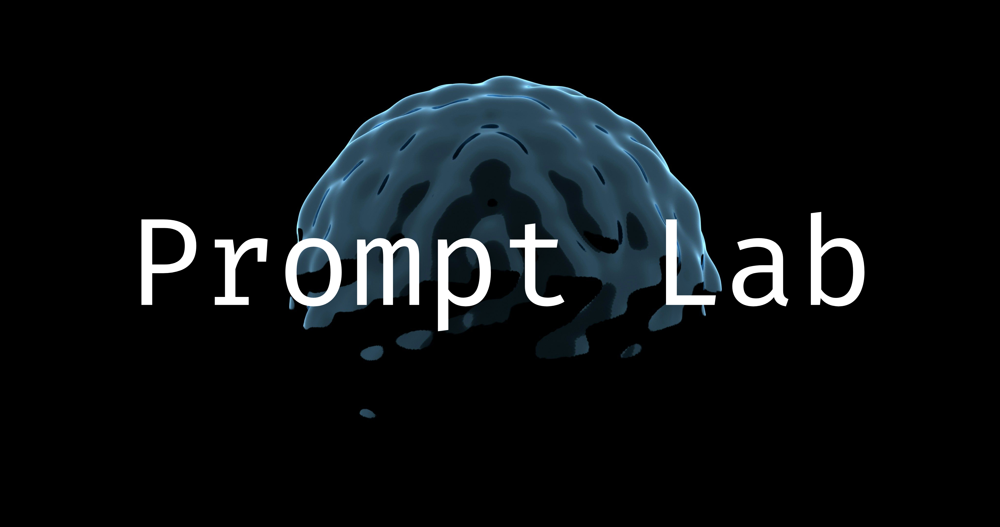

<div align="center">

# Prompt Lab

### A Structured Workspace for Prompt Engineering and AI Experimentation

**Version prompts. Run experiments. Understand how prompts work.**

</div>

---

## Overview

Prompt Lab is a system for structured prompt engineering.

Modern interaction with large language models is largely stateless and experimental. Prompts are rewritten repeatedly, experiments are difficult to reproduce, and insights are easily lost between sessions.

Prompt Lab introduces a structured workflow for prompt development by providing:

* Prompt version control
* Controlled experimentation across prompts and models
* Structured evaluation of prompt performance
* Systematic prompt optimization

The system transforms prompt iteration from ad-hoc trial-and-error into a reproducible engineering process.

---

## System Structure

Prompt Lab consists of two primary layers.

### Playground (Prompt Lab)

The Playground is an experimentation environment where prompts can be developed and analyzed.

Capabilities include:

* Prompt versioning
* A/B testing prompts and models
* Prompt scoring based on evaluation criteria
* Mass prompt experimentation
* Prompt breakdown analysis
* Data-driven prompt optimization

### Brain (Project Context Layer)

The Brain layer maintains persistent project context.

It stores structured project history, including:

* development progress
* experiments
* prompt evolution
* reasoning context

This allows users to move across conversations and models without losing project continuity.

---

## Current Development Status

The system is being built in phased releases.

### Phase 1

Prompt Versioning + A/B Testing

### Phase 2

Prompt Scoring

### Phase 3

Mass Prompting

### Phase 4

Prompt Breakdown

### Phase 5

Perfect Prompt Synthesis

Each phase results in a working deployable system.

---

## Technology Stack

**Frontend**

* Next.js
* TypeScript
* Tailwind CSS
* CodeMirror

**Backend**

* FastAPI
* SQLAlchemy
* Pydantic

**Infrastructure**

* PostgreSQL
* Redis
* Docker

**LLM Integrations**

* OpenAI
* Anthropic

---

## Repository Structure

```
project-brain/
│
├── frontend/              # Next.js application
├── backend/               # FastAPI server
├── infrastructure/        # Docker configuration
├── docs/                  # Project documentation
└── README.md
```

---

## Development Setup

### Requirements

* Node.js
* Python 3.11+
* Docker

### Run Locally

```bash
docker compose up
```

This starts:

* the frontend
* the API server
* PostgreSQL
* Redis

---

## Project Goals

Prompt Lab aims to make prompt engineering:

* reproducible
* measurable
* analyzable
* optimizable

The long-term goal is to transform prompt experimentation into a structured engineering discipline.
